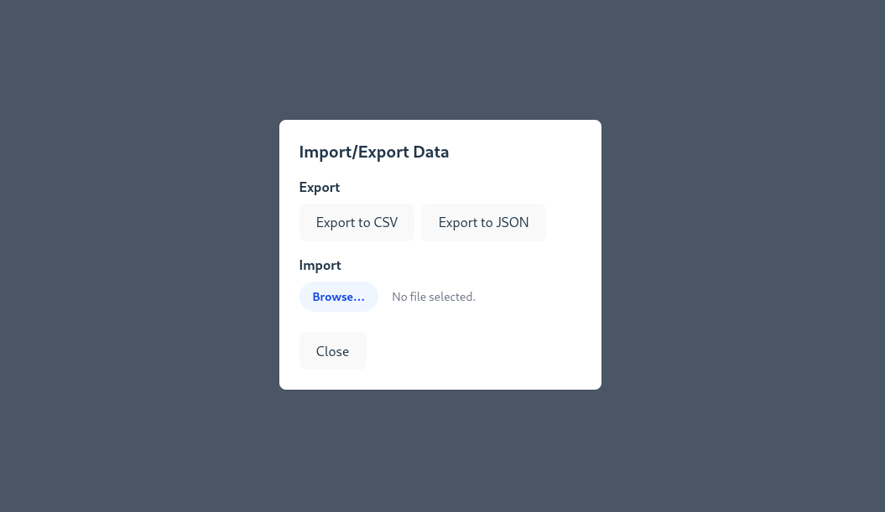

# Student Management System

A web-based student management system built with React, Express, and PostgreSQL. This system allows educational institutions to manage student records, faculty information, programs, and student statuses efficiently.

## Features

### Student Management
- Add new students with detailed information
- Edit existing student records
- Delete student records
- Search students by name, ID, and faculty
- View comprehensive student information including faculty, program, and status


### Advanced Search
- Real-time search functionality
- Filter students by multiple criteria:
  - Student Name
  - Student ID
  - Faculty Name

### Management Settings
Dedicated management interface for:
- Faculties
- Programs
- Student Statuses

Each category supports:
- Adding new entries
- Editing existing entries
- Viewing all entries


### System Information
- About dialog showing system version and build information
- Comprehensive logging system for troubleshooting


### Import/Export Data
- Import/export student data from CSV/JSON files


### Loging System
- Log all backend system activities for auditing and troubleshooting

## Installation

1. Install dependencies for both frontend and backend
```bash
# Install backend dependencies
cd Backend
npm install

# Install frontend dependencies
cd ../Frontend
npm install
```

4. Start the application
```bash
# Start backend server (from Backend directory)
npm run dev

# Start frontend development server (from Frontend directory)
npm run dev
```

## Usage Guide

### Managing Students

1. **View Students**
   - Navigate to the homepage to see the list of all students
   - Use the search bar to filter students

2. **Add New Student**
   - Click "Add New Student" button
   - Fill in all required fields
   - Click "Add" to save

3. **Edit Student**
   - Click "Edit" button on student row
   - Modify desired fields
   - Click "Update" to save changes

4. **Delete Student**
   - Click "Delete" button on student row
   - Confirm deletion in the popup

### Managing Settings

1. **Access Settings**
   - Click "Management Settings" button on homepage

2. **Manage Faculties/Programs/Statuses**
   - Enter new item details in input fields
   - Click "Add" button to create
   - Click "Edit" on existing items to modify
